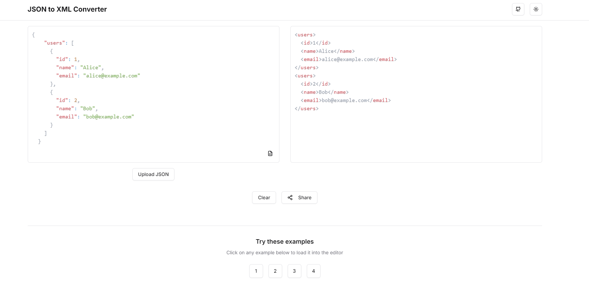
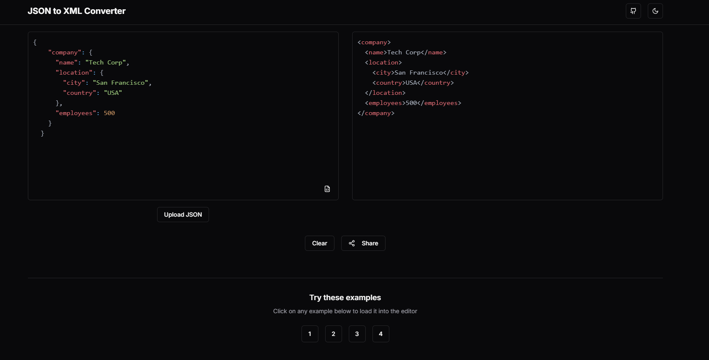

# JSON to XML Converter

A modern web application built with Next.js that allows users to convert JSON data to XML format with ease.

🌐 **[Try it live](https://json-to-xml.vercel.app/)**

| Light Mode | Dark Mode |
|------------|-----------|
|  |  |

## Features

- 🔄 Real-time JSON to XML conversion
- 🎨 Beautiful and responsive UI with dark/light mode support
- ✨ Syntax highlighting for both JSON and XML
- 📋 Easy copy/paste functionality
- 🔗 Shareable conversion links
- 📱 Mobile-friendly design
- 🎯 Built-in JSON validation and formatting
- 📚 Pre-built examples for quick testing

## Tech Stack

- [Next.js 15](https://nextjs.org/) - React framework
- [TypeScript](https://www.typescriptlang.org/) - Type safety
- [Tailwind CSS](https://tailwindcss.com/) - Styling
- [shadcn/ui](https://ui.shadcn.com/) - UI components
- [xml-js](https://github.com/nashwaan/xml-js) - JSON to XML conversion
- [React Syntax Highlighter](https://github.com/react-syntax-highlighter/react-syntax-highlighter) - Code highlighting

## Getting Started

### Prerequisites

- Node.js 20 or higher
- npm or yarn package manager

### Installation

1. Clone the repository:
```bash
git clone https://github.com/anibalalpizar/json-to-xml-converter.git
cd json-to-xml-converter
```

2. Install dependencies:
```bash
npm install
# or
yarn install
```

3. Start the development server:
```bash
npm run dev
# or
yarn dev
```

4. Open [http://localhost:3000](http://localhost:3000) in your browser

## Project Structure

```
src/
├── app/                 # Next.js app router
├── components/         
│   ├── convert/        # Conversion-related components
│   ├── layout/         # Layout components
│   └── ui/             # Reusable UI components
├── hooks/              # Custom React hooks
├── lib/                # Utility functions and services
│   ├── services/       # Business logic services
│   └── utils.ts        # Helper functions
└── types/              # TypeScript type definitions
```

## Usage

1. Enter or paste your JSON data in the left editor
2. The converted XML will appear in real-time on the right
3. Use the format button to beautify your JSON
4. Share your conversion by clicking the share button
5. Toggle between light and dark modes using the theme switcher

## Demo

Try out the live demo at [https://json-to-xml.vercel.app/](https://json-to-xml.vercel.app/)

## Contributing

Contributions are welcome! Please feel free to submit a Pull Request.

1. Fork the project
2. Create your feature branch (`git checkout -b feature/AmazingFeature`)
3. Commit your changes (`git commit -m 'Add some AmazingFeature'`)
4. Push to the branch (`git push origin feature/AmazingFeature`)
5. Open a Pull Request

## License

This project is licensed under the MIT License - see the [LICENSE](LICENSE) file for details.

## Support

If you find this project helpful, please give it a ⭐️ on GitHub!
